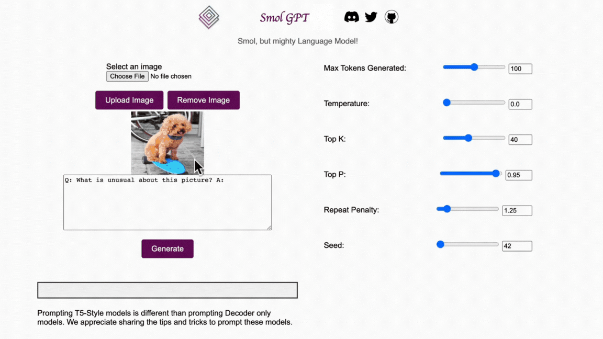

# Smol GPT-4

Multimodal instruction-following model for text generation that runs on your CPU.
Less than 12 GB of RAM required.



## Disclaimer
Models hallucinates - this is meant for fun. We do not recommend using the model in production - unless you ~~hallucinate for a living~~ know what you are doing.

The implementation may contain bugs and int4 quantization performed is not optimal – This might lead to worse performance than the original model.

## Usage

0. `git clone https://github.com/nolanoOrg/smol-gpt4`
1. `pip install -r requirements.txt`
2. `cd cpp && make`
3. `cd ..`
4. `python3 app.py` (May take a few minutes to download and load the model)
5. `Open `http://127.0.0.1:4241/` in your browser.`
```

## Contributing

Contributions are welcome. Please open an issue or a PR. New features will be community driven. Following features can be easily added for the model:

### Features
- Chat/Conversation mode is supported by the model, but not the app.
- Increase Input/Output length.
- GPTQ quantization.
- Interesting Prompts.

### Performance (Speed and Memory)
- Reduce RAM usage by 4x (down to ~4 GB)
    - Current Flask implementation loads the Bert & CLIP models twice for some reason.
    - Offload T5 encoder after getting the hidden representations.
    - Shift Vision and Bert model to int4/int8 and offload after using.
- Speed up 4x:
    - Keep the model loaded in RAM.
    - Integrate CALM (https://arxiv.org/abs/2207.07061) for 2x speedup during generation.
    - Translate Vision and Bert model to C.
- MMap Speed up.
- Support Smoller GPT 4 for running multimodal models in 4 GB of RAM.

## Unknowns about the model
- Performance on multiple collated images.
- Couple with OCR to reason about text from images.

## License
MIT

## Communication
- Nolano Discord: https://discord.gg/sWQsr4FE
- GitHub Issues.

## Scope and Limitations of this README
Given both the competitive landscape and the safety implications of _smol_ large-scale models like Smol GPT-4, this README contains no further details about the architecture (including model size), hardware, training compute, dataset construction, training method, or similar [1].

### References
[1] GPT-4 Technical Report, Team OpenAI, 2023
